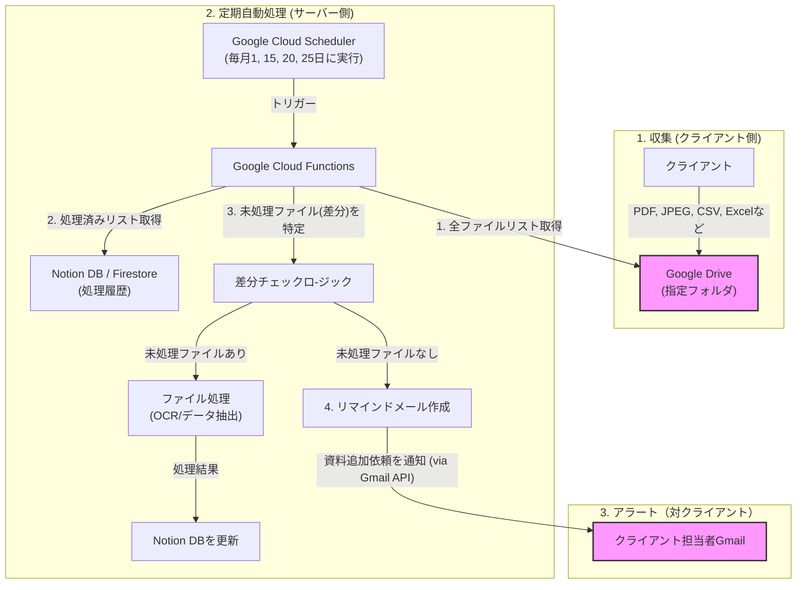

# 証憑収集・分類 自動化プロジェクト

## 概要

クライアントからの証憑や取引データ（PBC）の収集プロセスを効率化するための自動化プロジェクトです。
Google Driveを資料保管庫とし、**定期的にファイルの提出状況をチェック**します。ファイルが提出されていない場合は、**クライアントへ自動でリマインドメールを送信**することで、収集の抜け漏れを防ぎ、管理工数を削減することを目的とします。

## アーキテクチャ



## 処理フロー

### ステップ1: 収集 (クライアント側)
クライアントは、指定されたGoogle Driveの共有フォルダに、任意のタイミングで証憑ファイル（PDF, JPEGなど）や取引データ（CSV, Excel）をアップロードします。

### ステップ2: 定期自動処理 (サーバー側)
Google Cloud Schedulerによって、毎月決まった日（例：1, 15, 20, 25日）にシステムが自動実行されます。

1.  **差分チェック**: Google Driveのフォルダと過去の処理履歴を比較し、まだ処理されていない「未処理ファイル」を特定します。
2.  **ファイル処理**: 「未処理ファイル」が存在する場合、OCR処理やデータ抽出を行い、結果をNotionデータベースなどに登録します。
3.  **リマインド判断**: 「未処理ファイル」が**0件だった場合**（＝クライアントからの提出がなかった場合）、ステップ3の処理へ移行します。

### ステップ3: 定期リマインド（対クライアント）
ステップ2でクライアントからのファイル提出がなかったと判断された場合に、提出を促すリマインドメールを自動で送信します。

#### 対クライアントへのリマインドメール文面例
> **件名:** 【ご確認】YYYY年MM月分の資料アップロードのお願い
>
> **本文:**
>
> 株式会社〇〇 ご担当者様
>
> いつもお世話になっております。
>
> YYYY年MM月分の資料フォルダを確認しましたところ、以下のフォルダについて現時点でファイルの格納が確認できておりません。
>
> **【未投稿のフォルダ】**
> * `01_請求書`
> * `03_領収書`
> * `05_銀行取引明細`
>
> もし、これらの資料が今月分は**「該当なし」**の場合は、お手数ですがその旨ご返信いただけますと幸いです。
>
> 資料がお手元にございましたら、**3営業日以内**に以下の共有フォルダへアップロードいただけますようお願いいたします。
>
> **▼アップロード先フォルダURL**
> `https://drive.google.com/drive/folders/xxxxxxxxxx`
>
>
> （本メールと行き違いでご対応済みの場合は、ご容赦ください）
>
> *なお、期日までにご提出がない場合、大変恐縮ながら月次処理が翌月扱いとなりますのでご注意ください。*
>
> よろしくお願いいたします。

## セットアップ方法

### 1. ディレクトリ構成案
```
pbc-automation/
├── src/                    # メインのソースコード
│   ├── main.py             # Cloud Functionsのエントリポイント
│   ├── gdrive_handler.py   # Google Drive関連
│   ├── notion_handler.py   # Notion関連
│   └── gmail_handler.py    # Gmail関連
├── .env.example            # 環境変数のテンプレート
├── .gitignore
├── requirements.txt        # Pythonの依存ライブラリ
└── README.md
```

### 2. 必要なライブラリ
`requirements.txt`
```
google-api-python-client
google-cloud-vision
google-cloud-scheduler
notion-client
python-dotenv
```

### 3. 環境変数の設定
`.env.example` をコピーして `.env` ファイルを作成し、必要なAPIキーやIDを設定してください。
`.env.example`
```
# Google Cloud
GOOGLE_APPLICATION_CREDENTIALS="path/to/your/credentials.json"

# Notion
NOTION_TOKEN="your_notion_integration_token"
NOTION_DATABASE_ID="your_notion_database_id_for_records"

# Google Drive
GDRIVE_TARGET_FOLDER_ID="your_client_google_drive_folder_id"

# Gmail
GMAIL_SENDER_ADDRESS="your_sending_email@example.com"
GMAIL_CLIENT_RECIPIENT_ADDRESS="client_email@example.com"
```
